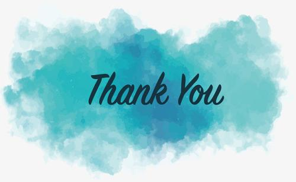
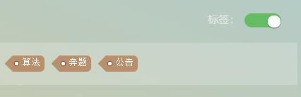
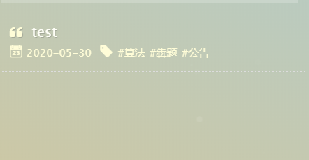

## 网站简介
益题（Yitee）是个拥有高质量题解的网站，主要面向于OIER。  
初学者可以在这里提高水平，普及组选手可以在此学习算法，更进一步。
提高组选手亦可在此巩固基础，获得新的发现。期待您的加入！

## 网站成员
xyzlh，X3B0A1  
如果您对建设网站有兴趣，可以联系我们。我们将非常欢迎您的加入😊

## 联系方式
QQ群:1019201086  
QQ:2762297828  3242954996 3342880042  
微信：helloworld-dlx  
邮箱：2762297828@qq.com或X3B0A1@gmail.com  
其余联系方式您可以在首页直接点击图标进入  
您还可以点击网页右下角的聊天图标联系我们噢😜

## 网站守则

**益题是一个供大家学习，获取知识的社区，为了维护社区风气，净化社区环境，我们制定了以下守则：**

* 禁止在评论区、反馈区发送无意义内容
* 禁止以任何形式辱骂他人
* 禁止在站内发表任何违反法律、社会公德、人身攻击的言论
* 禁止发布未经允许的站外广告
* 禁止在其他任何地方对益题造成不良影响

## 益题大事记  
```
2020.4.26 益题团队正式创建  
2020.8.21 益题网站建设工作正式完工&&益题用户交流群正式创建
2020.9.1 益题网站进行试运行&&上传第一篇文章
2020。10.1 益题网站正式上线
```

## 感谢
非常感谢执笔春秋、yzpqlzh、csx、红烧辣兔头几位朋友为我们设计的头像👌  
Thanks a lot!  


## Q&A
### 1.Q:非网站管理员可以投稿吗？
A: 当然可以。您可以通过我们的联系方式将内容打包发给我们进行审核（内容包括.md文件，昵称，有效联系方式，
题目标签，题目来源）。通过后，我们就会将您的题解放在网站上。同时我们也会联系您商量稿酬。  

### 2.Q:益题的题目难度是如何划分的？  
A:目前我们是有入门-普及-进阶-提高四个等级，以后可能会更新（会有公告告知）  

### 3.Q:如何查看益题的公告？  
A:Step1:在网页左下角看到“所有文章”，点击进去  
  
Step2:可以看到一个Tag，单击等到其变成绿色（如果已经是绿色就不用操作了）。  
   
Step3:在其下方弹出的框中找到“公告”标签，单击就可以在下方看到相关的文章了。  
 